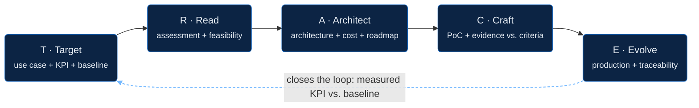

---
hide:
  - toc
---

# The TRACE cycle

Five stages, each with a concrete deliverable and an exit criterion: we don't move to the next stage until it's met.

The dashed arrow is ZirconTrace's signature: the result measured in Evolve is always compared against the objective defined in Target. It's not a promise, it's a verifiable artifact.

## T · Target

We translate the business problem into a measurable outcome. We leave with prioritized use cases, each with an owner, a KPI, and a baseline, not a list of ideas.

[See the Target detail →](etapas/target.md)

## R · Read

We x-ray the current state: data, architecture, risks, feasibility. We use AWS Well-Architected Review and the AWS Cloud Adoption Framework as our lens, plus an explicit check of regulatory exposure (in Chile, under Law 21.719 on data protection).

[See the Read detail →](etapas/read.md)

## A · Architect

We design the target solution, the roadmap, and the cost, reviewed against the 6 pillars of Well-Architected, with cost estimation done before we build, not after.

[See the Architect detail →](etapas/architect.md)

## C · Craft

We build iteratively and test the hypothesis against success criteria defined upfront. Without that, there's no honest way to say whether the PoC worked.

[See the Craft detail →](etapas/craft.md)

## E · Evolve

Production, measuring results, and continuous improvement. This is where we close the loop: we measure the real result against the objective we defined in Target. That comparison, objective vs. result, is ZirconTrace's signature.

[See the Evolve detail →](etapas/evolve.md)

---

**Cross-cutting layers**, present across all five stages: governance and compliance (including the regional compliance catalog), FinOps, and change management.
