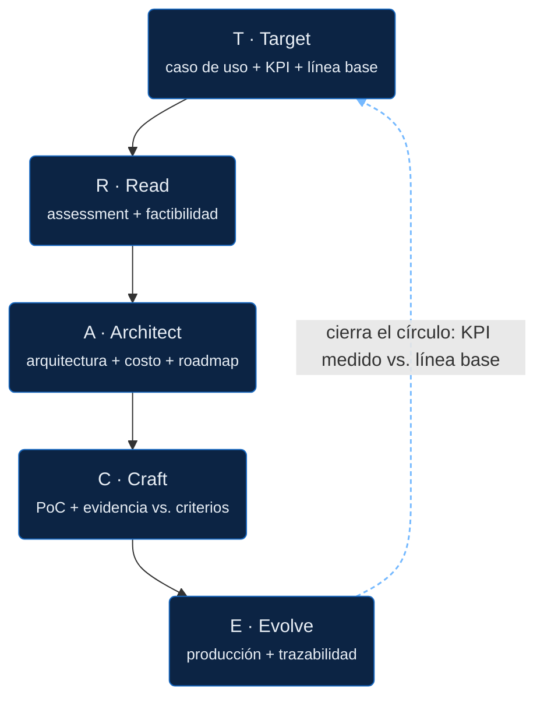

# El arco TRACE

Cinco etapas, cada una con un entregable concreto y un criterio de salida: no seguimos a la próxima etapa sin cumplirlo.

La flecha punteada es la firma de ZirconTrace: el resultado medido en Evolve se compara siempre contra el objetivo definido en Target. No es una promesa, es un artefacto verificable.

## T · Target

Traducimos el problema de negocio en un resultado medible. Salimos de acá con casos de uso priorizados, cada uno con un dueño, un KPI y una línea base, no con una lista de ideas.

[Ver el detalle de Target →](etapas/target.md)

## R · Read

Radiografiamos el estado actual: datos, arquitectura, riesgos, factibilidad. Usamos AWS Well-Architected Review y el AWS Cloud Adoption Framework como lente, más una verificación explícita de exposición regulatoria (en Chile, bajo la Ley 21.719 de protección de datos).

[Ver el detalle de Read →](etapas/read.md)

## A · Architect

Diseñamos la solución objetivo, el roadmap y el costo, revisado contra los 6 pilares de Well-Architected, con la estimación de costos hecha antes de construir, no después.

[Ver el detalle de Architect →](etapas/architect.md)

## C · Craft

Construimos de forma iterativa y probamos la hipótesis contra criterios de éxito definidos de antemano. Sin eso, no hay forma honesta de decir si el PoC funcionó.

[Ver el detalle de Craft →](etapas/craft.md)

## E · Evolve

Producción, medición de resultados y mejora continua. Acá es donde cerramos el círculo: medimos el resultado real contra el objetivo que definimos en Target. Esa comparación, objetivo vs. resultado, es la firma de ZirconTrace.

[Ver el detalle de Evolve →](etapas/evolve.md)

---

**Capas transversales**, presentes en las cinco etapas: gobernanza y compliance (incluyendo el catálogo de cumplimiento regional), FinOps, y gestión del cambio.
